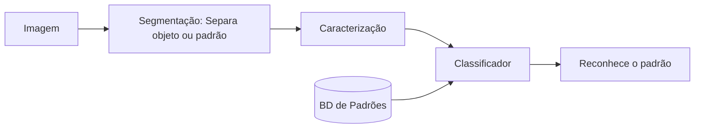
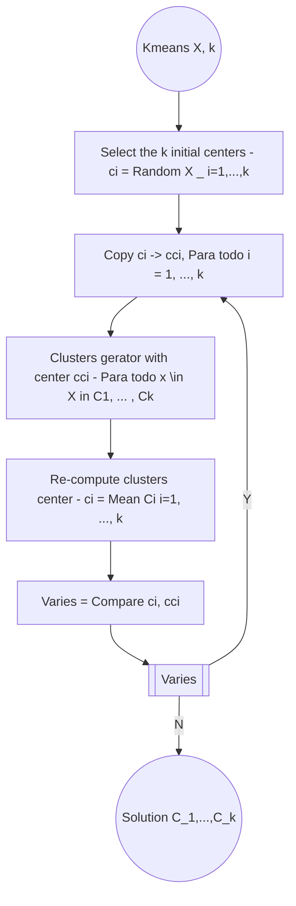
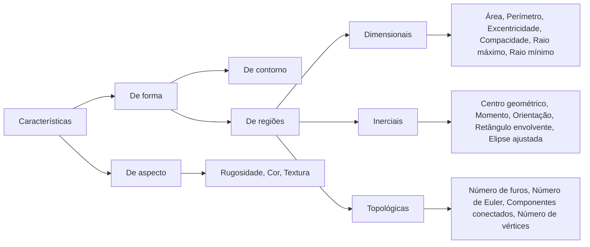

# mermaid

```mermaid
graph LR;
id1[Imagem]
id2[Segmentação: Separa objeto ou padrão]
id3[Caracterização]
id4[(BD de Padrões)]
id5[Classificador]
id6[Reconhece o padrão]

id1 --> id2 --> id3
id3 & id4 --> id5 --> id6
```

XXX

```mermaid
flowchart TB;

id1((Kmeans X, k))
id2[Select the k initial centers - ci = Random X _ i=1,...,k ]
id3[Copy ci -> cci, Para todo i = 1, ..., k]
id4[Clusters gerator with center cci - Para todo x \in X in C1, ... , Ck]
id5[Re-compute clusters center - ci = Mean Ci i=1, ..., k]
id6[Varies = Compare ci, cci]
id7[[Varies]]
id8((Solution C_1,...,C_k))

id1 --> id2 --> id3 --> id4 --> id5 --> id6 -->
id7 -->|Y| id3
id7 -->|N| id8
```

```mermaid
flowchart LR
    A1[Características]
    B1[De forma]
    B2[De aspecto]
    C1[De contorno]
    C2[De regiões]
    C3[Rugosidade, Cor, Textura]
    D1[Dimensionais]
    D2[Inerciais]
    D3[Topológicas]
    E1[Área, Perímetro, Excentricidade, Compacidade, Raio máximo, Raio mínimo]
    E2[Centro geométrico, Momento, Orientação, Retângulo envolvente, Elipse ajustada]
    E3[Número de furos, Número de Euler, Componentes conectados, Número de vértices]

    A1 --> B1 & B2;
    B1 --> C1 & C2;
    B2 --> C3;
    C2 --> D1 & D2 & D3;
    D1 --> E1;
    D2 --> E2;
    D3 --> E3;
```
